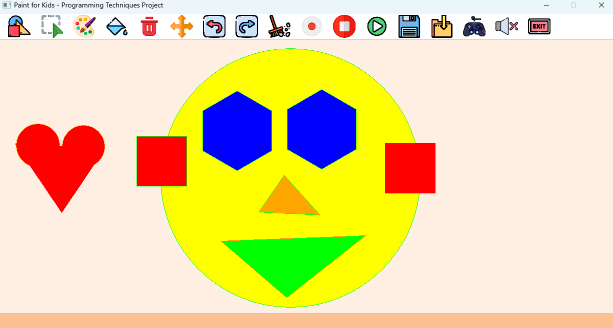
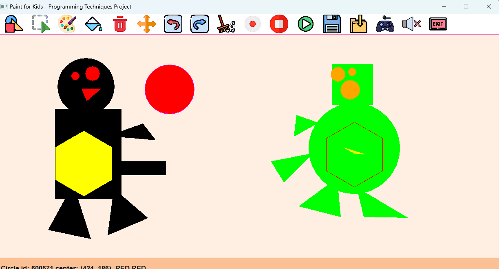

# 🎨 Paint For Kids CPP APP

An application to let kids draw and play with shapes.
Made as a project for Programming Techniques course in the Computer Engineering Department first-year Cairo University Egypt.

---

## 🔥 Abstract

- Paint for kids is an application made to teach kids shapes in a colorful and playful way.
- It provides a playing mode that teaches kids to differentiate figure types and colors.

## 😀 Screenshots

#### Draw mode screenshot



#### Save and load Graph screenshot


#### Record screenshot



#### Play Mode screenshot


---

## 🫡 Our team

- [Akram Hany](https://github.com/akramhany)
- [Ahemd Hamed](https://github.com/AhmedHamed3699)
- [Amir Kedis](https://github.com/amir-kedis)

---

## Conventions and team guidelines.

---

### Naming:

- Minimize the use of abbreviations
- Do not abbreviate by deleting letters within a word. As a rule of thumb, an abbreviation is probably OK if it's listed in Wikipedia.

```cpp
int nmbr = 5; ❌
int number = 5; ✅
```

- Variables should be written in "camelCase"

```cpp
int Important-VaRiable = 5; ❌
int importantVariable = 5; ✅
```

- Class names and types should be written in "PascalCase"

```cpp
class Distance
{
  ...
};
```

- Constants should be written in UPPERCASE

```cpp
const double PI = 3.1468;
```

- Filenames should be all lowercase and can include dashes (-)

```
main-file-in-project.cpp
```

- Functions should start with a capital letter and have a capital letter for each new word

```cpp
void DrawRectangle()
{
  ...
}
```

- accessors and mutators may be named like variables Using CamalCase (getters and setters)

```cpp
void Input:getColor()
{
  ...
}
```

- Functions and Methods should start with a verb

```cpp
string SelectColor();
void DrawRectangle(Point p1, Point p2);
```

- Functions that return a bool should start with Is

```cpp
bool IsEven(int);
bool IsValidAge(int age);
```

---

### Comments:

- use `//` syntax
- every non-obvious class or struct declaration should have an accompanying comment that describes what it is for and how it should be used.
- before every function declaration should be implementation comment structured like this

```cpp
/// <summary>
///
/// </summary>
/// <param name=""></param>
/// <param name=""></param>
/// <param name=""></param>
/// <param name=""></param>
/// <returns></returns>
```

_To Toggle this comment on, Go to the line before declaration and press <kbd>Ctrl</kbd> + <kbd>/</kbd>_

- TODO comments should be used like this

```cpp
/// TODO: (To-Do Item)
```
